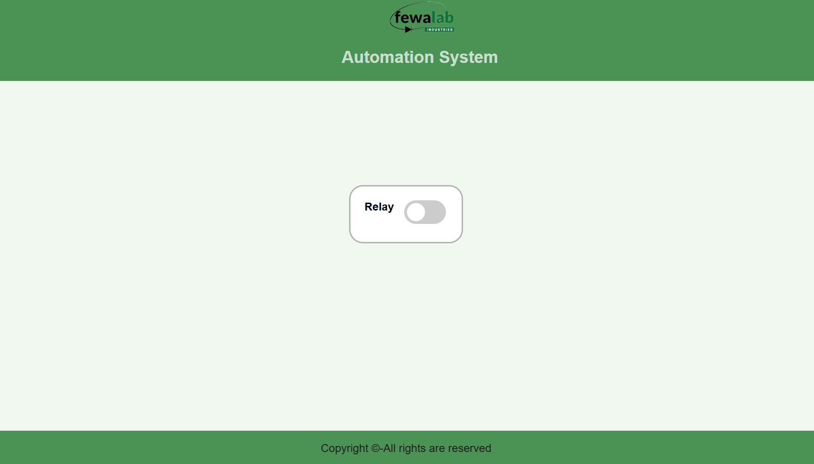

# ESP12_IOT_Relay

This project is an IoT-based home automation system using an ESP8266 microcontroller and a single relay module. The relay is controlled via a web interface and the file system is managed using LittleFS. This system allows you to control a household or industrial appliance such as a light, fan, or air conditioner from a web browser.

Hardware Requirements

    * ESP8266 microcontroller (I used the ESP-12E module)
    * Single relay module
    * Household appliance (e.g., bulb, fan, air conditioner)
    * Breadboard and jumper wires
    * Power supply for ESP8266

Software Requirements

    * Arduino IDE
    * LittleFS library for ESP8266
    * ESP8266 board package for Arduino
    * Web browser

Installation and Setup
  1. Setup Arduino IDE

    * Install the Arduino IDE from Arduino's official website.
    * Open Arduino IDE and go to File > Preferences.
    * In the "Additional Boards Manager URLs" field, add the following URL: http://arduino.esp8266.com/stable/package_esp8266com_index.json.
    * Go to Tools > Board > Boards Manager, search for ESP8266, and install it.

  2. Install LittleFS Library

    * In the Arduino IDE, go to Sketch > Include Library > Manage Libraries.
    * Search for LittleFS and install the ESP8266 LittleFS library.

  3. Upload the Code

    * Open the home_automation.ino file in Arduino IDE.
    * Select the correct board and port:
        - Board: NodeMCU 1.0 (ESP-12E Module) (or your specific ESP8266 module)
        - Port: Your corresponding port (e.g., COM3)
    * Upload the code to your ESP8266.

  4. Upload Files to LittleFS

    * Go to Tools > ESP8266 LittleFS Data Upload to upload the web interface files to the ESP8266's LittleFS file system.

Usage

  1. Connect to the ESP8266

    After uploading the code, the ESP8266 will start a Wi-Fi Access Point (AP).
    Connect to the AP using a Wi-Fi-enabled device (SSID and password will be specified in the code).

  2. Access the Web Interface

    Open a web browser and navigate to 192.168.4.1 (default IP address for the ESP8266 AP).
    The web interface will load, allowing you to control the relay connected to your household appliance.
